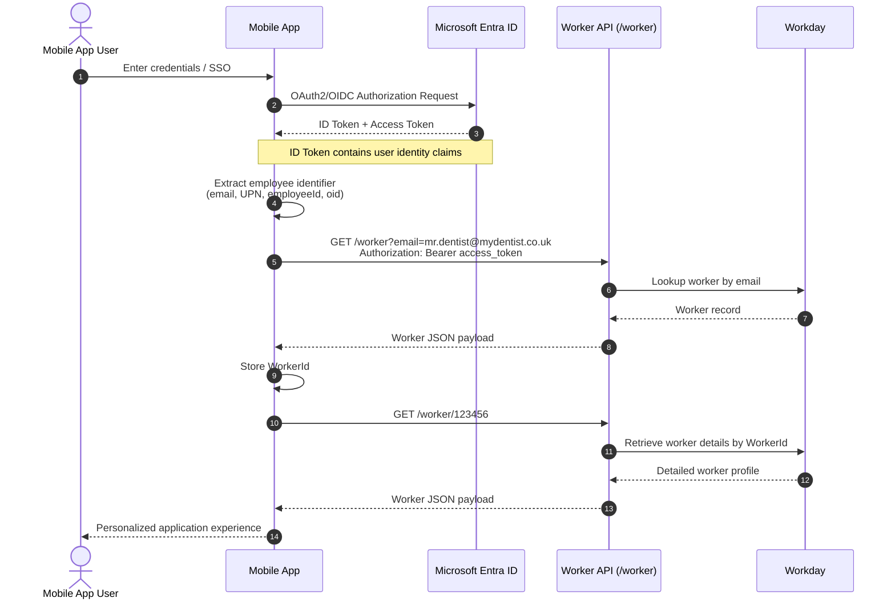

# MyDentist

## Getting Started

```bash
npx expo start
```

In the output, you'll find options to open the app in a

- [development build](https://docs.expo.dev/develop/development-builds/introduction/)
- [Android emulator](https://docs.expo.dev/workflow/android-studio-emulator/)
- [iOS simulator](https://docs.expo.dev/workflow/ios-simulator/)

### Starting Over

If you make mistakes or break things, simply run this get back to a working state.

```bash
npm run reset-project
```

## Authentication Basics

### Standard Flow

Below is a pretty standard sequence diagram showing the flow of credentials and data for a Entra-based user. This has been extended to include the Workday API to add the context.


