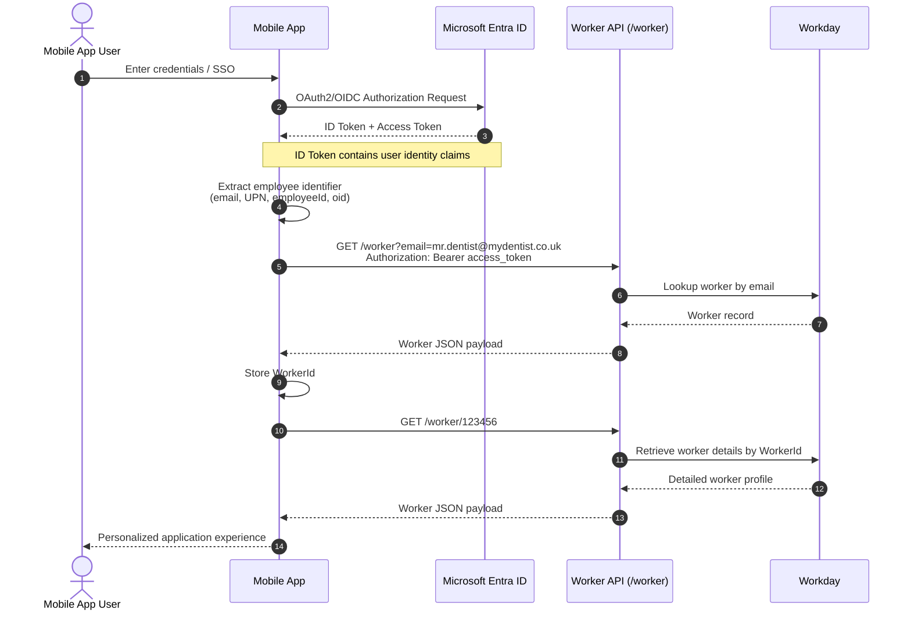

# MyDentist

## Getting Started

```bash
npx expo start
```

In the output, you'll find options to open the app in a

- [development build](https://docs.expo.dev/develop/development-builds/introduction/)
- [Android emulator](https://docs.expo.dev/workflow/android-studio-emulator/)
- [iOS simulator](https://docs.expo.dev/workflow/ios-simulator/)

### Starting Over

If you make mistakes or break things, simply run this get back to a working state.

```bash
npm run reset-project
```

## Authentication Basics

### Standard Flow

Below is a pretty standard sequence diagram showing the flow of credentials and data for a Entra-based user. This has been extended to include the Workday API to add the context.



## Workday Integration

The [Workday REST API](https://community.workday.com/sites/default/files/file-hosting/restapi/) seems relatively straightforward, but the general flow we'll adopt is...

1. Start with workerId
2. GET worker core record
3. Extract references:
   - locationId
   - managerId
   - supervisoryOrgId
   - costCenterId
   - positionId
4. Follow references for location/org/manager detail
5. Use RaaS or SOAP for non-standard data:
   - certificates
   - NHS / CDA metrics
   - mentoring relationships
   - messaging
   - tenant-specific finance fields
6. Return one normalised mobile-app payload

## Endpoint Assumptions

### Getting a Worker (practitioner)

```http
GET /workday/api/staffing/v5/{tenant}/workers/{workerId}
Authorization: Bearer {access_token}
Accept: application/json

{
  "id": "abc123workerid",
  "descriptor": "Jane Smith",
  "workerType": {
    "id": "employee",
    "descriptor": "Employee"
  },
  "primaryJob": {
    "jobTitle": "Consultant",
    "businessTitle": "Clinical Consultant",
    "location": {
      "id": "loc_001",
      "descriptor": "London Practice"
    },
    "supervisoryOrganization": {
      "id": "org_123",
      "descriptor": "Digital Health"
    }
  },
  "manager": {
    "id": "worker_mgr_001",
    "descriptor": "Alex Brown"
  },
  "workEmail": "jane.smith@mydentist.co.uk"
}
```

### Getting a Location (practice)

```http
GET /workday/api/staffing/v5/{tenant}/locations/{locationId}
Authorization: Bearer {access_token}
Accept: application/json

{
  "id": "london_practice_001",
  "name": "London Practice",
  "type": "Practice Location",
  "address": {
    "line1": "1 Example Street",
    "city": "London",
    "postalCode": "SW1A 1AA",
    "country": "GB"
  }
}
```

### Getting Jobs

```http
curl --request GET \
  --url 'https://{host}/ccx/api/staffing/v5/{tenant}/jobs/{jobId}' \
  --header 'Authorization: Bearer {access_token}' \
  --header 'Accept: application/json'

{
  "id": "JOB-12345",
  "descriptor": "Senior Consultant",
  "jobProfile": {
    "id": "JP-001",
    "descriptor": "Senior Consultant"
  },
  "businessTitle": "Principal Consultant",
  "worker": {
    "id": "WK-123456",
    "descriptor": "Jane Smith"
  },
  "workerType": {
    "id": "Employee",
    "descriptor": "Employee"
  },
  "position": {
    "id": "POS-98765",
    "descriptor": "Senior Consultant Position"
  },
  "supervisoryOrganization": {
    "id": "SUP-1001",
    "descriptor": "Consulting Practice"
  },
  "location": {
    "id": "LOC-001",
    "descriptor": "London Practice"
  },
  "timeType": {
    "id": "FullTime",
    "descriptor": "Full Time"
  }
}
```

### Getting Community (Org. Chart)

```http
curl --request GET \
  --url '/workday/api/staffing/v5/{tenant}/supervisoryOrganizations/{supervisoryOrgId}' \
  --header 'Authorization: Bearer {access_token}' \
  --header 'Accept: application/json'

{
  "id": "SUP-1001",
  "descriptor": "Consulting Practice",
  "manager": {
    "id": "WK-999999",
    "descriptor": "Alex Brown"
  },
  "organizationType": {
    "id": "SUP",
    "descriptor": "Supervisory Organization"
  },
  "parentOrganization": {
    "id": "SUP-1000",
    "descriptor": "Professional Services"
  }
}
```

### Getting Certificates & Learning

TBC...

### Getting Remission/Finance

TBC...
