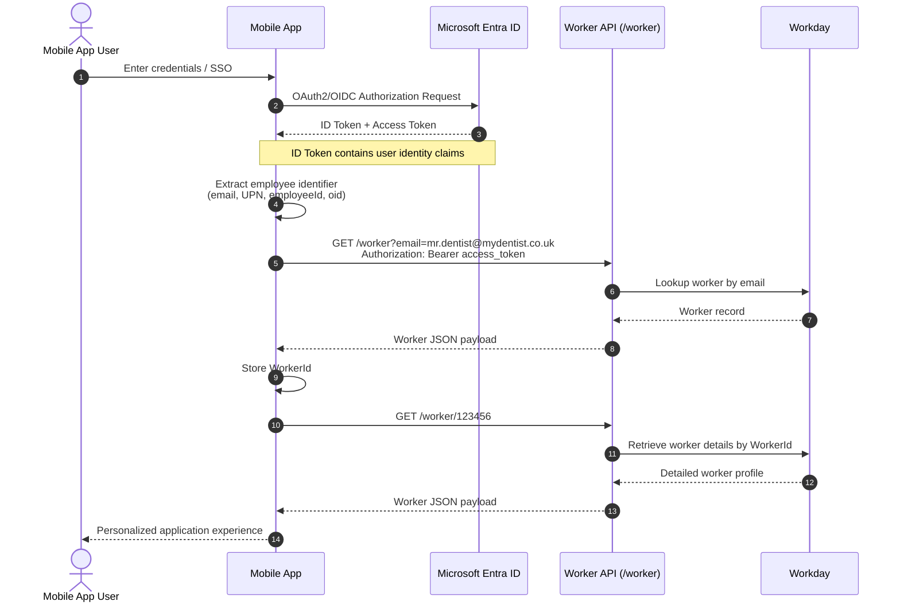

# MyDentist

### Getting Started

```bash
npx expo start
```

In the output, you'll find options to open the app in a

- [development build](https://docs.expo.dev/develop/development-builds/introduction/)
- [Android emulator](https://docs.expo.dev/workflow/android-studio-emulator/)
- [iOS simulator](https://docs.expo.dev/workflow/ios-simulator/)

#### Starting Over

If you make mistakes or break things, simply run this get back to a working state.

```bash
npm run reset-project
```

### Authentication Basics

#### Standard Flow

Below is a pretty standard sequence diagram showing the flow of credentials and data for a Entra-based user. This has been extended to include the Workday API to add the context.



### Workday Integration

The [Workday REST API](https://community.workday.com/sites/default/files/file-hosting/restapi/) seems relatively straightforward, but the general flow we'll adopt is...

1. Start with workerId
2. GET worker core record
3. Extract references:
   - locationId
   - managerId
   - supervisoryOrgId
   - costCenterId
   - positionId
4. Follow references for location/org/manager detail
5. Use RaaS or SOAP for non-standard data:
   - certificates
   - NHS / CDA metrics
   - mentoring relationships
   - messaging
   - tenant-specific finance fields
6. Return one normalised mobile-app payload

### Endpoint Overview

The table below shows some common aggregates for data items and respective endpoints. This isn't an exchaustive - or even tested - list, but it is another assumption that _could_ be right!

| Use Case                   | Recommended Endpoint(s)                                                        |
| -------------------------- | ------------------------------------------------------------------------------ |
| My Profile                 | `GET /workers/{workerId}`                                                      |
| My Practice Location       | `GET /jobs/{jobId}/workspace`, `GET /locations/{locationId}`                   |
| My Team                    | `GET /supervisoryOrganizations/{orgId}/members`                                |
| My Manager                 | `GET /workers/{workerId}` or `GET /supervisoryOrganizations/{orgId}`           |
| Org Chart                  | `GET /supervisoryOrganizations/{orgId}/orgChart`                               |
| Skills & Certifications    | `GET /workers/{workerId}/explicitSkills`, `GET /workers/{workerId}/skillItems` |
| Service History            | `GET /workers/{workerId}/serviceDates`                                         |
| Career Information         | `GET /jobProfiles`, `GET /jobFamilies`                                         |
| Office Finder              | `GET /locations`, `GET /locations/{locationId}`                                |
| Business Unit / Department | `GET /organizations`, `GET /supervisoryOrganizations/{orgId}`                  |

### Endpoint Assumptions

#### Getting a Worker (practitioner)

```http
GET /workday/api/staffing/v5/{tenant}/workers/{workerId}
Authorization: Bearer {access_token}
Accept: application/json

{
  "id": "abc123workerid",
  "descriptor": "Jane Smith",
  "workerType": {
    "id": "employee",
    "descriptor": "Employee"
  },
  "primaryJob": {
    "jobTitle": "Consultant",
    "businessTitle": "Clinical Consultant",
    "location": {
      "id": "loc_001",
      "descriptor": "London Practice"
    },
    "supervisoryOrganization": {
      "id": "org_123",
      "descriptor": "Digital Health"
    }
  },
  "manager": {
    "id": "worker_mgr_001",
    "descriptor": "Alex Brown"
  },
  "workEmail": "jane.smith@mydentist.co.uk"
}
```

#### Getting a Location (practice)

```http
GET /workday/api/staffing/v5/{tenant}/locations/{locationId}
Authorization: Bearer {access_token}
Accept: application/json

{
  "id": "london_practice_001",
  "name": "London Practice",
  "type": "Practice Location",
  "address": {
    "line1": "1 Example Street",
    "city": "London",
    "postalCode": "SW1A 1AA",
    "country": "GB"
  }
}
```

#### Getting Jobs

```http
GET /workday/api/staffing/v5/{tenant}/jobs/{jobId}
Authorization: Bearer {access_token}
Accept: application/json

{
  "id": "JOB-12345",
  "descriptor": "Senior Consultant",
  "jobProfile": {
    "id": "JP-001",
    "descriptor": "Senior Consultant"
  },
  "businessTitle": "Principal Consultant",
  "worker": {
    "id": "WK-123456",
    "descriptor": "Jane Smith"
  },
  "workerType": {
    "id": "Employee",
    "descriptor": "Employee"
  },
  "position": {
    "id": "POS-98765",
    "descriptor": "Senior Consultant Position"
  },
  "supervisoryOrganization": {
    "id": "SUP-1001",
    "descriptor": "Consulting Practice"
  },
  "location": {
    "id": "LOC-001",
    "descriptor": "London Practice"
  },
  "timeType": {
    "id": "FullTime",
    "descriptor": "Full Time"
  }
}
```

#### Getting Community (Org. Chart)

```http
GET /workday/api/staffing/v5/{tenant}/supervisoryOrganizations/{supervisoryOrgId}
Authorization: Bearer {access_token}
Accept: application/json

{
  "id": "SUP-1001",
  "descriptor": "Consulting Practice",
  "manager": {
    "id": "WK-999999",
    "descriptor": "Alex Brown"
  },
  "organizationType": {
    "id": "SUP",
    "descriptor": "Supervisory Organization"
  },
  "parentOrganization": {
    "id": "SUP-1000",
    "descriptor": "Professional Services"
  }
}
```

---

#### Getting Certificates & Learning

TBC...

#### Getting Remission/Finance

TBC...

---

## Technical Landscape

### NFRs (Non-Functional Requirements)

- Availability: 99.5%+ uptime; app keeps working when partners are down.
- Speed: Fast start and navigation; key screens load in under a second where possible.
- Offline: Schedule/profile usable without internet; auto-syncs when back online.
- Scale: Handles busy periods; protects partners with rate limits.
- Security: Single sign-on, biometrics, encryption, certificate pinning.
- Privacy/Compliance: Only necessary data; GDPR/NHS aligned; full audit trail.
- Observability: Crashes and performance tracked; clear SLO dashboards.
- Maintainability: Typed contracts, feature flags, safe/gradual releases.
- Accessibility: WCAG AA; readable, high-contrast; local dates and £.
- Data Freshness: Clear "last updated"; targets per data type.
- Licensing: Monitor usage; stay within partner limits.
- Support: Runbooks; quick recovery for major issues.

### Technical Tooling (what we use and why)

- React Native + Expo: One codebase for iOS/Android; fast updates.
- TypeScript: Fewer bugs; clearer contracts.
- TanStack Query + React Navigation: Smooth data and navigation.
- Secure Storage + Biometrics: Safe, quick sign-in.
- Push (APNs/FCM via Expo): Reminders and alerts.
- Backend-for-Frontend (Node.js): One simple API for the app; shapes and caches data.
- Azure API Management: Throttling, quotas, and security at the edge.
- Redis + Postgres + Azure Blob: Fast cache, small app DB, secure files.
- Service Bus: Reliable background jobs.
- Workday/Boomi, Microsoft Graph, Power BI/Fabric, Denpay: Connect to sources through adapters.
- Observability (OpenTelemetry, Sentry/Datadog): See errors and performance end-to-end.
- CI/CD (Azure DevOps, EAS Build/Update): Automated builds and safe rollouts.
- Testing (Jest, Detox/Maestro, Pact): Unit, UI, and contract tests.
- IaC + Security (Terraform/Bicep, Snyk/Renovate): Repeatable infra; safe dependencies.
- Feature Flags + OpenAPI + ADRs: Controlled releases; clear APIs; documented decisions.

### Knowns vs Unknowns

- Knowns: Tech stack (Expo RN), main systems (Workday, DW/PowerBI→Fabric, SharePoint/Wisdom, Denpay), DW is stale/fragmented, target features list, limited SME access.
- Unknowns: Final access to Workday (direct vs Boomi), exact rate/licensing limits, identity/MDM rules, schedule system diversity, Fabric timeline, Denpay/API contracts, data freshness per feature, MVP priorities.

### Assumptions and Risks

- Assumptions: Azure AD SSO allowed; non-prod sandboxes exist; BFF permitted; short‑lived links for sensitive files; minimum OS set; push notifications allowed.
- Risks: Partner rate limits/costs; stale DW erodes trust; schedule APIs vary; security/compliance errors; limited SME time; Fabric migration churn; possible Expo eject; app store/MDM delays.

### Mitigations and Strategies

- Reliability/Speed: Cache at the backend, "serve now, refresh later", circuit breakers, precomputed KPIs.
- Security: Least-privilege access, encrypted caches, re-auth for sensitive views.
- Limits/Costs: Throttle and batch; measure usage; pre-pull into an "app cache".
- Delivery: Feature flags, mock services, parallel tracks (UI now, integrations later).
- Data Trust: Show "last updated"; allow quick issue reporting.
- Schedule: Start read-only with most common system; ICS fallback.
- Workday Path: Pluggable adapter for Boomi or direct REST; switch by config.
- BYOD/MDM: Support both with Conditional Access and in-app biometrics.

### Agile Spikes (time-boxed investigations)

- Workday access: Boomi vs direct REST (auth, limits, costs).
- Power BI vs Fabric: Best path for KPIs (performance, throttling).
- Schedule ingestion: Top PMS API vs ICS fallback; time zones/recurrence.
- Device security: Jailbreak/root checks; biometric re-lock UX.
- Notifications: Delivery reliability and deep links.
- Payslips: Secure link vs proxy; PDF performance on low-end Android.
- Revenue/UDA: Server precompute and cache invalidation.
- Graph/SharePoint: Permissions model; large list performance.
- Offline: What to cache, how to encrypt, sync timing.
- Performance budget: Cold start, bundle size, image/CDN strategy.
- Intune/MDM: Brokered auth behavior and policies.
- Accessibility: Screen reader and large text on key screens.
- Observability: End-to-end trace propagation and log redaction.

---

## Feature Slides

### CPD & Learning

Make learning easy and personal so clinicians don’t hunt across multiple systems. Show required courses, CPD hours, and deadlines clearly, with two-tap access and reminders, even if Workday/Wisdom data is messy today.

- Personalized dashboard: show mandatory training, due dates, and CPD hours at a glance.
- Two taps to action: start/continue a course from the home screen.
- Smart reminders: push notifications before deadlines; snooze and escalate.
- Source-aware: label “from Workday/Wisdom” and show last updated time.
- Offline notes: allow saving brief learning notes; sync later.
- Future-proof: adapter to Wisdom/SharePoint for improved personalization once available.

### Earnings

Provide a trustworthy, fast view of pay, remittance, revenue per hour, and UDA progress, with clearer lab charges. Reduce steps compared to Workday and avoid stale data confusion.

- Improved payslip/remittance: clean list, secure preview, quick PDF share to approved folders.
- Revenue breakdown: NHS vs Private, daily/weekly/monthly with “last updated”.
- UDA tracker: target vs achieved, simple trend.
- Lab bills: separate tile for visibility; flag anomalies.
- Two taps from home: Pay and Earnings always within reach.
- Caching and freshness: show timestamp; warn if warehouse data is older than SLA.

### Comms

Cut noise and centralize essential messages so clinicians don’t juggle many apps. Make it easy to act (open course, view schedule) from a message.

- Unified inbox: training, HR, practice updates in one place.
- Actionable cards: deep links into learning, schedule, or payslips.
- Notification controls: opt-in by category to reduce overload.
- Share to approved locations: save/email documents to 365/SharePoint with one tap.
- Source tags: “from 365/Workday/Wisdom”; show delivery status.

### Directory

Help clinicians find people and referral pathways quickly, including photos where possible without R4 friction. Keep it light and always available.

- Search by name/specialty/location; quick actions (call/email).
- Specialist referral info: contact, practice, hours.
- Photo handling: avoid pulling from R4; use corporate photos or placeholders.
- Stale-safe: cache results; show freshness tag.
- Permissions-aware: role-based visibility if needed.

### Job Board

Make internal roles easy to discover and apply without bouncing between tools.

- Simple feed: roles, locations, key requirements.
- Quick filters: specialty, region, seniority.
- Save/share: send to email or save to 365 folders directly.
- One tap to apply: deep link to Workday job page with SSO.
- Status badges: “new”, “closing soon”.

### Resources

Bring key documents and templates together with trustworthy versioning so clinicians don’t guess which file is correct.

- Curated library: policies, clinical guides, templates from SharePoint/Wisdom.
- Quick search and favorites; last opened.
- Version/owner shown; last updated timestamp.
- Offline access to starred items; encrypted at rest.
- Save/email to approved destinations (365) with audit trail.

### Performance Tracking - CPD

Give a simple, reliable picture of compliance and progress so managers don’t chase, and clinicians stay on track.

- CPD summary: hours earned vs required; gaps highlighted.
- Mandatory status: pass/fail, next due date.
- Evidence store: upload certificates; link completions from Wisdom.
- Alerts: renewal reminders; manager view later (subject to access).
- Data quality guardrails: show source and potential issues clearly.

### SSO

Reduce “too many logins” and speed up secure access on modern devices.

- Single Sign-On via Entra (Azure AD) with biometrics (Face ID/Fingerprint).
- Two-tap entry to key features post-login.
- Session unlock with biometrics; short-lived tokens; certificate pinning.
- BYOD/MDM friendly: supports both managed and personal devices with policies.

### Push Notifications

Deliver the right nudge at the right time, without spam, and link directly to action.

- Training deadlines, payslip available, schedule changes within 5 seconds of PMS update.
- Rich actions: “Start course”, “View schedule”, “Open payslip”.
- Quiet hours and preferences; audit of sends.
- Reliability: retries, deduplication, and delivery metrics.

### Mentors

Connect clinicians with mentors and communities to reduce isolation and improve growth.

- Mentor directory: filter by specialty/region.
- Simple request flow: availability windows, preferred contact method.
- Community groups: topic-based spaces; link to resources/courses.
- Light-weight tracking: session count, goals; optional feedback.
- Privacy-first: no sensitive patient data in threads; clear conduct guidelines.

---

## Alignment with current NFRs

- Biometric login: SSO with Face ID/Fingerprint at app unlock and sensitive areas.
- Calendar <5s updates: subscribe to PMS events; push schedule changes; cache with fast refresh.
- Two taps to key features: home tiles for Calendar, Pay, CPD; bottom nav for persistence.
- 99.9% availability: resilient BFF, caching, circuit breakers, graceful degradation.
- GDC/GDPR compliance: data minimization, consent/audit, encryption, retention policies.
- Error logging: end-to-end monitoring with actionable alerts.
- Concurrency at scale: horizontally scalable backend; rate limits per user/system.

---

## Acknowledged data limitations and how UI handles them

- Workday names/roles: display cleaned names; offer “suggest a fix”; show source and timestamp.
- UDA/Revenue from multiple systems: label source (Workday/Denpay/Power BI); show “last updated”.
- Lab bills from finance: separate tile with “data may be delayed” banner if needed.
- CPD/Mandatory from Workday/Wisdom: highlight potential gaps; allow user-provided evidence upload.
- Schedule from Carestream R4: prioritize read-only with fast deltas; avoid photo pulls from R4.
- Remittance/Payslips: secure short-lived links; save/email to 365 with audit.

---

## Device and UX constraints applied

- iOS: target 16.0+ (min 15.1); Android: target 11 (API 30)+.
- Locked to portrait; layouts optimized for ≥900×500 px.
- Performance budget: two taps to action; lightweight lists; minimal images; local caching.
