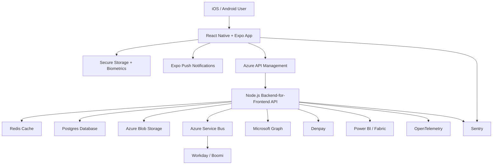

# Technical Architecture

## Tech Stack & Tooling

### Mobile Application

| Stack                           | Reasoning                                                                                                                                                                                                              |
| ------------------------------- | ---------------------------------------------------------------------------------------------------------------------------------------------------------------------------------------------------------------------- |
| **React Native + Expo**         | Single codebase reduces development and maintenance effort while enabling rapid delivery across both iOS and Android platforms. Expo provides streamlined builds, OTA updates, notifications, and device integrations. |
| **TypeScript**                  | Strong typing improves maintainability, developer productivity, and code quality across a growing codebase.                                                                                                            |
| **Redux Toolkit**               | Provides predictable state handling, simplified Redux patterns, and scalable application architecture.                                                                                                                 |
| **React Navigation**            | Industry-standard navigation solution supporting deep linking, authentication flows, and platform-specific navigation patterns.                                                                                        |
| **Secure Storage + Biometrics** | Protects sensitive tokens and user data while enabling seamless authentication using Face ID, Touch ID, and Android Biometrics.                                                                                        |
| **Expo Push Notifications**     | Provides a cross-platform mechanism for delivering notifications and user engagement messages.                                                                                                                         |

### Backend API & Platform

| Stack                              | Reasoning                                                                                                                                         |
| ---------------------------------- | ------------------------------------------------------------------------------------------------------------------------------------------------- |
| **Node.js (Backend-for-Frontend)** | Enables mobile-specific orchestration, aggregation of backend services, simplified client interactions, and isolation of enterprise integrations. |
| **Azure API Management (APIM)**    | Provides authentication, rate limiting, monitoring, API versioning, policy enforcement, and a secure edge for external traffic.                   |
| **Redis**                          | Improves performance and scalability by reducing load on downstream services and databases.                                                       |
| **PostgreSQL**                     | Mature, reliable, cloud-friendly database platform suitable for transactional and operational data.                                               |
| **Azure Blob Storage**             | Cost-effective storage for files, documents, exports, media assets, and other unstructured content.                                               |
| **Azure Service Bus**              | Enables asynchronous communication, decoupling, resilience, and reliable integration with external systems.                                       |
| **OpenAPI**                        | Establishes a consistent API specification, improves documentation, and enables contract-driven development.                                      |

### Enterprise Integrations

| Stack               | Reasoning                                                                                                   |
| ------------------- | ----------------------------------------------------------------------------------------------------------- |
| **Workday / Boomi** | Supports employee onboarding, HR processes, and integration with existing enterprise systems and workflows. |
| **Microsoft Graph** | Provides secure access to user profiles, organisational data, groups, calendars, and directory services.    |
| **Denpay**          | Supports business-specific payment or benefits processes within the wider platform ecosystem.               |

### Data & Analytics

| Stack                           | Reasoning                                                                                           |
| ------------------------------- | --------------------------------------------------------------------------------------------------- |
| **Power BI / Microsoft Fabric** | Delivers operational reporting, dashboards, business intelligence, and data-driven decision making. |
| **PostgreSQL**                  | Serves as a structured source of operational and reporting data.                                    |
| **Azure Blob Storage**          | Supports storage of exports, reporting datasets, and analytical assets.                             |

### CI/CD & Quality Engineering

| Stack                        | Reasoning                                                                                            |
| ---------------------------- | ---------------------------------------------------------------------------------------------------- |
| **Azure DevOps**             | Provides a unified platform for repositories, pipelines, deployments, work tracking, and governance. |
| **Jest**                     | Fast and widely adopted testing framework for validating application logic and reducing regressions. |
| **End-to-End (E2E) Testing** | Validates complete user journeys and integration points before release.                              |
| **Terraform**                | Enables repeatable, version-controlled infrastructure deployments across environments.               |
| **App Tester / TestFlight**  | Supports controlled beta testing and validation before public release.                               |

### Observability & Governance

| Stack                                    | Reasoning                                                                                                            |
| ---------------------------------------- | -------------------------------------------------------------------------------------------------------------------- |
| **OpenTelemetry**                        | Provides vendor-neutral tracing, metrics, and instrumentation across the platform.                                   |
| **Sentry**                               | Captures application errors, crashes, and performance issues to support operational support and troubleshooting.     |
| **Architecture Decision Records (ADRs)** | Creates a documented history of technical decisions, trade-offs, and rationale to support long-term maintainability. |

### Key Outcomes

| Outcome                                   | Supporting Tooling                                  |
| ----------------------------------------- | --------------------------------------------------- |
| Single cross-platform mobile codebase     | React Native, Expo, TypeScript                      |
| Secure enterprise-grade API architecture  | Azure APIM, Node.js BFF, Secure Storage, Biometrics |
| Scalable and resilient integrations       | Azure Service Bus, Workday, Microsoft Graph         |
| Repeatable deployments and infrastructure | Azure DevOps, Terraform                             |
| High quality releases                     | Jest, E2E Testing, TestFlight                       |
| Operational visibility and supportability | OpenTelemetry, Sentry                               |
| Strong governance and maintainability     | OpenAPI, ADRs, TypeScript                           |

## Feature to Tooling Map

| Capability                         | Rationale                                                                                                                                                                                                                    |
| ---------------------------------- | ---------------------------------------------------------------------------------------------------------------------------------------------------------------------------------------------------------------------------- |
| Cross-platform mobile development  | **React Native + Expo** provide a single codebase for iOS and Android, reducing development and maintenance effort while accelerating delivery. Expo simplifies builds, OTA updates, notifications, and device integrations. |
| Application state management       | **Redux Toolkit** provides predictable and scalable state management patterns, simplifying complex application workflows and improving maintainability.                                                                      |
| Navigation and deep linking        | **React Navigation** is the industry-standard solution for navigation, supporting authentication flows, deep linking, and platform-native navigation experiences.                                                            |
| Push notifications                 | **Expo Push Notifications** provide a unified cross-platform approach for delivering user engagement and operational notifications.                                                                                          |
| Secure local storage               | **Secure Storage** protects sensitive information such as access tokens and user credentials on the device.                                                                                                                  |
| Biometric authentication           | **Face ID, Touch ID, and Android Biometrics** improve both security and user experience by enabling secure passwordless authentication.                                                                                      |
| API gateway and policy enforcement | **Azure API Management (APIM)** provides authentication, authorisation, rate limiting, monitoring, versioning, and governance at the API edge.                                                                               |
| Backend orchestration (BFF)        | **Node.js Backend-for-Frontend** abstracts enterprise complexity from the mobile client, aggregates services, and optimises APIs for mobile consumption.                                                                     |
| Enterprise messaging               | **Azure Service Bus** enables resilient asynchronous communication and decouples backend services from enterprise integrations.                                                                                              |
| HR integration                     | **Workday and Boomi** provide integration with employee onboarding, HR workflows, and existing enterprise systems.                                                                                                           |
| Microsoft 365 integration          | **Microsoft Graph** enables secure access to user profiles, organisational data, groups, calendars, and directory services.                                                                                                  |
| Benefits/payment integration       | **Denpay** supports business-specific payment and employee benefits processes within the platform ecosystem.                                                                                                                 |
| Relational data storage            | **PostgreSQL** provides a robust, cloud-native relational database platform for transactional and operational data.                                                                                                          |
| Caching and performance            | **Redis** improves responsiveness and scalability by reducing repeated database and integration calls.                                                                                                                       |
| Document and file storage          | **Azure Blob Storage** provides scalable and cost-effective storage for documents, media, exports, and other unstructured content.                                                                                           |
| Reporting and analytics            | **Power BI and Microsoft Fabric** provide enterprise reporting, operational dashboards, and analytical capabilities.                                                                                                         |
| Source control and CI/CD           | **Azure DevOps** provides repositories, pipelines, deployment automation, work tracking, and release governance within a single platform.                                                                                    |
| Infrastructure as Code             | **Terraform** enables repeatable, version-controlled infrastructure provisioning across environments.                                                                                                                        |
| Unit testing                       | **Jest** provides fast and reliable automated testing of application logic and business rules.                                                                                                                               |
| End-to-end testing                 | **E2E testing** validates complete user journeys and integration points before release.                                                                                                                                      |
| Mobile beta distribution           | **TestFlight and App Tester** enable controlled testing and validation before production release.                                                                                                                            |
| Telemetry and tracing              | **OpenTelemetry** provides standardised metrics, traces, and instrumentation across the platform.                                                                                                                            |
| Error monitoring                   | **Sentry** captures application crashes, exceptions, and performance issues to support operational monitoring and troubleshooting.                                                                                           |
| Architecture governance            | **Architecture Decision Records (ADRs)** provide an auditable history of technical decisions, rationale, and trade-offs to support long-term maintainability.                                                                |

---

## Deployment/Runtime Architecture

