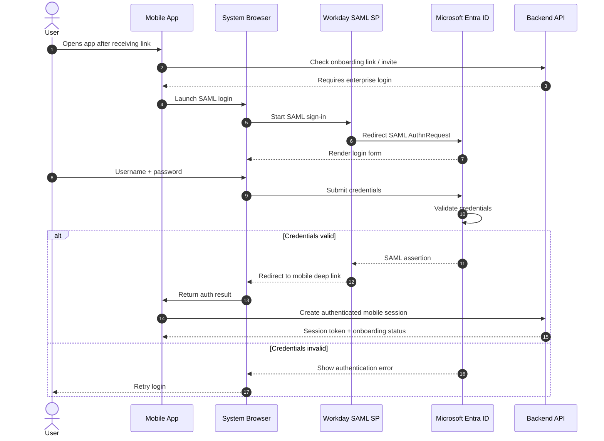
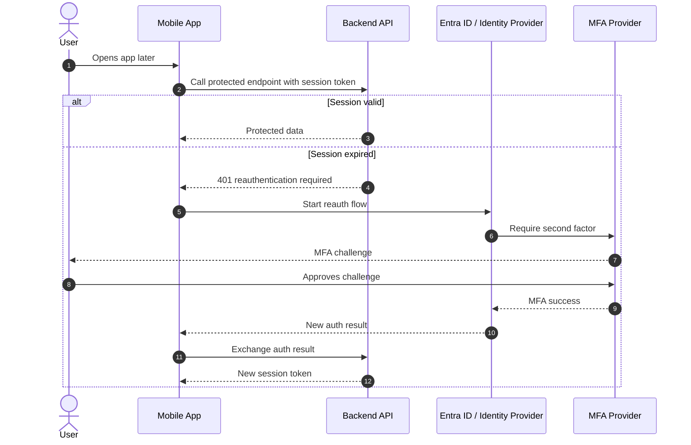
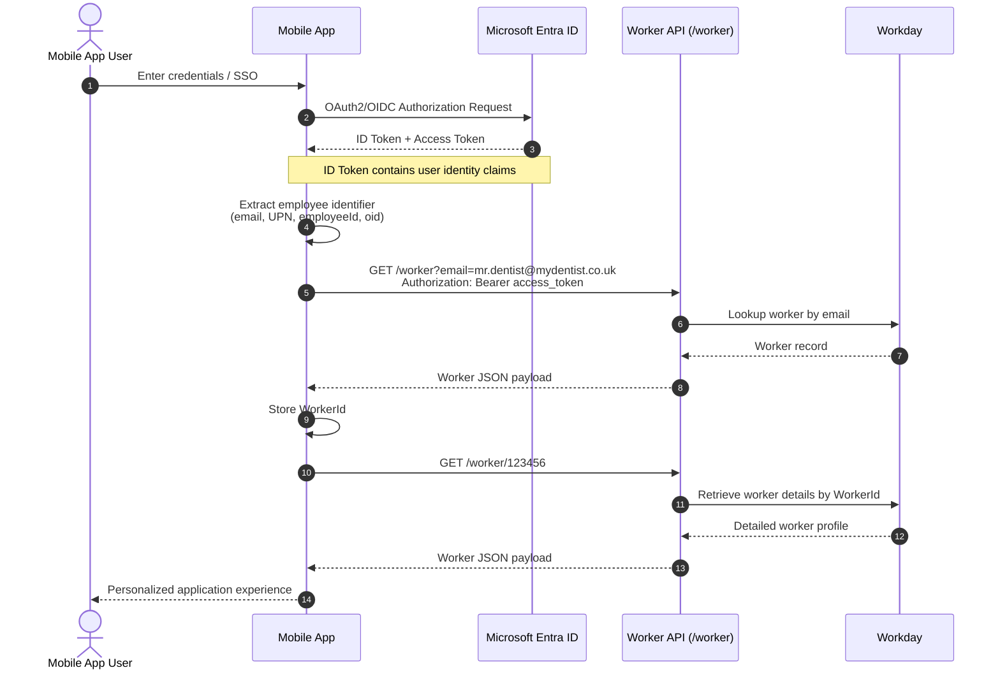
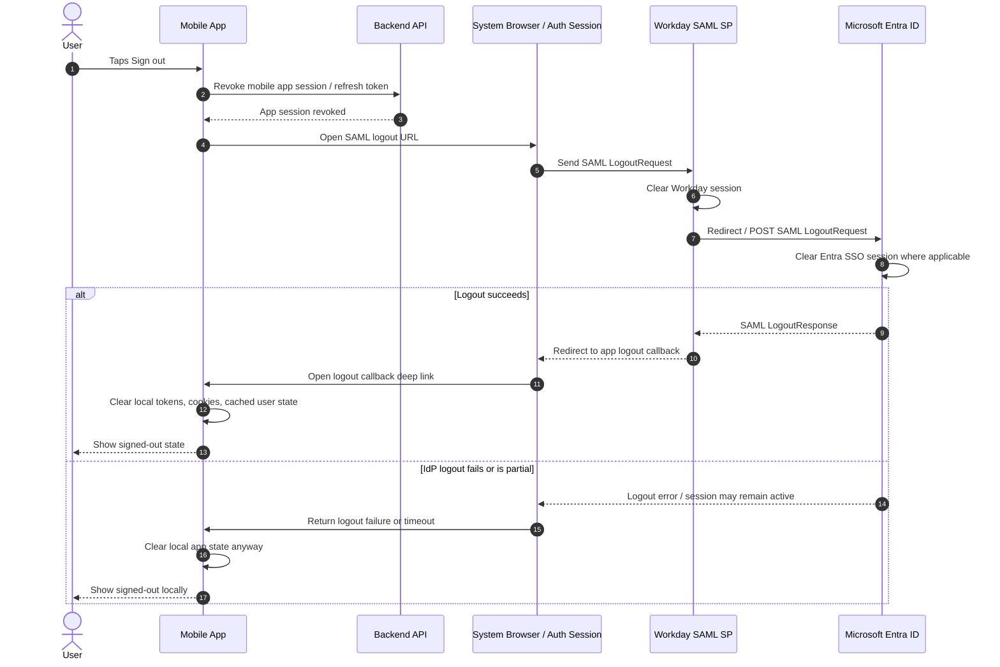

# Authentication Flows

## Initial Login & Onboarding

This is the initial user login experience via Workday. They will be directed to Workday, enter their username and password and then referred back to the mobile app to begin onboarding via the app.

---

## Resuming App Auth Flow

Once the user has finished using the app, they will inevitably go away for a while eventually coming back to pick up where they left off. This is the auth process that will follow...

---

## Standard High-level Auth Flow

Below is a pretty standard sequence diagram showing the flow of credentials and data for a Entra-based user. This has been extended to include the Workday API to add the context.

---

## End Session (Logout) Flow

Once the user has finished their session they can choose to logout of the app. This is what happens:

