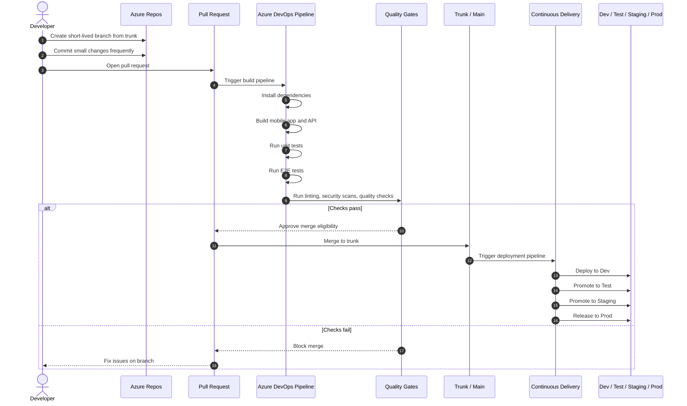
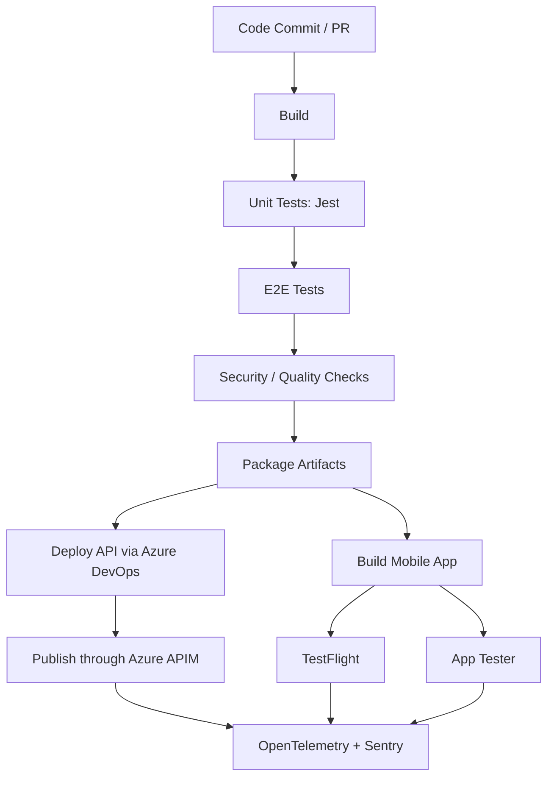

# Development Fundamentals

## Proposed GIT Development Flow



## CI/CD Pipeline



## Code Convention Standards

### Shared TypeScript Standards

| Area                      | Rule                                                                                                                      |
| ------------------------- | ------------------------------------------------------------------------------------------------------------------------- |
| Language                  | Use **TypeScript strict mode** across mobile and API projects.                                                            |
| Formatting                | Use **Prettier** as the single formatting authority.                                                                      |
| Linting                   | Use **ESLint** with project-specific rules for React Native and Node.js.                                                  |
| Naming                    | Use `camelCase` for variables/functions, `PascalCase` for components/classes/types, and `UPPER_SNAKE_CASE` for constants. |
| Imports                   | Use absolute imports or path aliases; avoid deep relative paths such as `../../../`.                                      |
| Errors                    | Never throw raw strings. Use typed error classes or structured error objects.                                             |
| Environment Configuration | Access environment variables only through a validated configuration module.                                               |
| Logging                   | Never log secrets, tokens, passwords, or personally identifiable information.                                             |
| Testing                   | Add tests for business logic, API handlers, validation, and critical user journeys.                                       |

---

### Expo Mobile Application Conventions

| Area             | Rule                                                                                     |
| ---------------- | ---------------------------------------------------------------------------------------- |
| Components       | Use functional components only.                                                          |
| File Naming      | Use `PascalCase.tsx` for components and screens.                                         |
| Hooks            | Place reusable hooks in `hooks/` and prefix with `use`, e.g. `useAuthSession`.           |
| Navigation       | Centralise routes and route parameters in a typed navigation definition.                 |
| State Management | Keep local UI state in components; use Redux Toolkit only for shared application state.  |
| API Access       | Do not call APIs directly from screens; use service or client modules.                   |
| Secure Storage   | Store tokens only in secure storage and never in AsyncStorage.                           |
| Biometrics       | Treat biometrics as a local unlock mechanism, not as proof of server identity.           |
| Deep Linking     | Validate all inbound deep-link parameters before use.                                    |
| Styling          | Keep styles close to components unless shared across multiple screens.                   |
| Accessibility    | Add labels and hints for all interactive elements.                                       |
| Error Handling   | Display user-friendly messages while sending technical details to observability tooling. |

### Recommended Mobile Structure

```text
src/
  app/
  components/
  screens/
  navigation/
  hooks/
  services/
  store/
  config/
  utils/
  types/
```

### Node.js API Conventions

| Area             | Rule                                                                                              |
| ---------------- | ------------------------------------------------------------------------------------------------- |
| API Design       | Use RESTful resource naming and consistent HTTP methods.                                          |
| Validation       | Validate all inbound requests at the API boundary using schemas.                                  |
| DTOs             | Use explicit request and response DTOs; do not expose internal domain models directly.            |
| Error Responses  | Return consistent error responses with `code`, `message`, and optional `correlationId`.           |
| Async Operations | Use `async/await`; avoid unhandled promises.                                                      |
| Authentication   | Do not trust client-supplied identity claims without validating tokens or APIM-forwarded context. |
| Logging          | Include correlation IDs in all logs.                                                              |
| Versioning       | Version APIs explicitly, e.g. `/v1/employees`.                                                    |
| OpenAPI          | Keep OpenAPI definitions synchronised with implemented endpoints.                                 |
| Pagination       | Use a consistent pagination strategy across all list endpoints.                                   |
| Idempotency      | Use idempotency keys for operations that may be retried.                                          |

### Standard Error Response

```json
{
  "code": "VALIDATION_ERROR",
  "message": "One or more fields are invalid.",
  "correlationId": "abc-123"
}
```

### Azure Functions Conventions

| Area                 | Rule                                                                               |
| -------------------- | ---------------------------------------------------------------------------------- |
| Function Design      | Keep functions thin and move business logic into services.                         |
| Triggers             | Use HTTP triggers for APIs and queue/topic triggers for asynchronous workloads.    |
| Dependency Injection | Use explicit service registration and avoid hidden global dependencies.            |
| Configuration        | Read settings from environment variables or Key Vault-backed application settings. |
| Retry Handling       | Design non-HTTP functions to be idempotent as retries may occur.                   |
| Timeouts             | Avoid long-running HTTP functions; move lengthy processing to queues.              |
| Bindings             | Keep bindings simple and avoid embedding business logic in binding configuration.  |
| Local Development    | Maintain a safe `local.settings.json` template without secrets.                    |

---

### Azure API Management (APIM) Conventions

| Area             | Rule                                                                                                |
| ---------------- | --------------------------------------------------------------------------------------------------- |
| API Boundary     | Treat APIM as the public contract boundary.                                                         |
| Policies         | Use APIM policies for authentication, rate limiting, headers, transformations, and IP restrictions. |
| Business Logic   | Do not implement business logic in APIM policies.                                                   |
| Correlation      | Generate or forward correlation IDs from APIM to backend services.                                  |
| Security Headers | Apply standard security headers at the APIM layer where appropriate.                                |
| Versioning       | Publish APIs using clear versioning and lifecycle management practices.                             |
| OpenAPI          | Import and publish APIs directly from OpenAPI specifications.                                       |
| Rate Limiting    | Apply client-appropriate rate limiting policies.                                                    |

### Pull Request Standards

| Rule                                                                              |
| --------------------------------------------------------------------------------- |
| Code must build locally before submission.                                        |
| Linting must pass.                                                                |
| Unit tests must pass.                                                             |
| API contract changes must include OpenAPI updates.                                |
| New endpoints must include validation and error handling.                         |
| Mobile screens must include loading, empty, and error states.                     |
| Secrets must never be committed to source control.                                |
| New functionality must include appropriate observability.                         |
| Architectural decisions must be captured in an ADR where appropriate.             |
| Pull requests should remain small and focused to support trunk-based development. |
| All pull requests require at least one peer review before merging.                |
