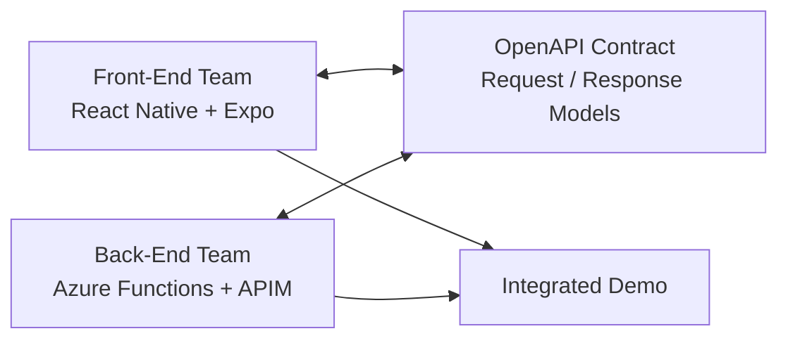
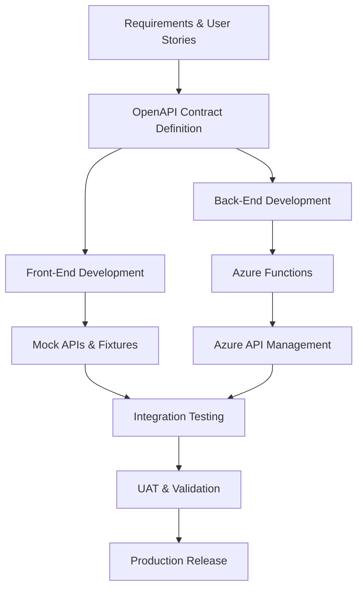

# Development Team

The solution will be delivered using **two parallel workstreams**, enabling the mobile application and backend platform to progress independently whilst remaining aligned through agreed API contracts and regular integration checkpoints.

This approach maximises delivery throughput, reduces dependency bottlenecks, and allows both teams to work concurrently against clearly defined interfaces.

---

## Team Structure

| Team                     | Responsibility                                                                                                                                                                                  |
| ------------------------ | ----------------------------------------------------------------------------------------------------------------------------------------------------------------------------------------------- |
| Front-End Engineers (x2) | React Native mobile application development, user journeys, page lifecycle management, state management, navigation, authentication flows, local storage, notifications, and UI implementation. |
| Back-End Engineers (x2)  | Azure Functions development, API design, OpenAPI specifications, Azure API Management configuration, enterprise integrations, infrastructure provisioning, and platform engineering.            |

---

## Front-End Responsibilities

The front-end team will focus on delivering the mobile application experience using React Native and Expo.

Key responsibilities include:

- Establishing application architecture and coding conventions
- Building screens and user journeys
- Implementing navigation and deep-linking
- Managing page lifecycle and state transitions
- Implementing authentication and onboarding experiences
- Developing reusable components and design patterns
- Implementing secure storage and biometric authentication
- Integrating push notifications
- Building analytics and telemetry instrumentation
- Creating API client abstractions

To minimise dependency on backend completion, the front-end team may develop against:

- Mock APIs
- Static JSON fixtures
- Local development services
- Simulated network latency
- Contract-first API definitions

This enables UI development, testing, and stakeholder demonstrations to continue independently of backend implementation progress.

---

## Back-End Responsibilities

The back-end team will focus on delivering the platform and integration capabilities.

Key responsibilities include:

- Defining API contracts and OpenAPI specifications
- Building Azure Functions using Node.js and TypeScript
- Implementing authentication and authorisation
- Publishing APIs through Azure API Management (APIM)
- Implementing integration patterns with enterprise systems
- Building asynchronous messaging solutions using Azure Service Bus
- Provisioning infrastructure using Terraform
- Implementing observability, telemetry, and monitoring
- Supporting performance, scalability, and security requirements

The backend team will provide:

- OpenAPI specifications
- Example payloads
- Contract documentation
- Mock endpoint definitions
- Test environments

to allow front-end development to proceed independently.

---

## Contract-First Development

The primary integration mechanism between the teams will be a contract-first approach.

API contracts will be agreed before implementation begins and maintained through OpenAPI specifications.

Benefits include:

- Independent development streams
- Earlier validation of requirements
- Reduced integration risk
- Faster feedback cycles
- Improved testability
- Better API governance

---

## Delivery Model

---

## Parallel Delivery Workflow

---

## Integration Checkpoints

The teams should align regularly through structured integration checkpoints.

| Activity                     | Frequency        |
| ---------------------------- | ---------------- |
| API Contract Review          | Weekly           |
| Architecture Review          | Weekly           |
| Front-End / Back-End Sync    | Twice Weekly     |
| Integrated Demo              | End of Sprint    |
| Environment Readiness Review | Before UAT       |
| Production Readiness Review  | Prior to Release |

---

## Definition of Done

A feature is considered complete when:

- API contract is agreed and documented
- Mobile implementation is complete
- Backend implementation is complete
- Automated tests pass
- OpenAPI documentation is updated
- Infrastructure changes are deployed through Terraform
- Telemetry and monitoring are implemented
- Security requirements are satisfied
- Integrated testing has passed
- Feature has been demonstrated and accepted
